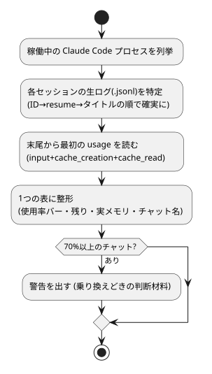

# claude-code-context-meter — チャットの容量計

**context-meter** は、いま動いているすべての Claude Code チャット（セッション）の
**コンテキスト使用量**を1つの表で出す計測ツールです。

A capacity meter for running Claude Code sessions: context-window usage,
percentage of the limit, remaining tokens, process memory, and the chat's
actual display name — in one Markdown table. Works on both Windows and
Linux (devcontainers / Codespaces), standard library only.
The rest of this README is in Japanese.

## しくみ（図解）



## 出力例

```
## チャットのメモリー使用量（2099-01-01 12:00 時点・上限 1,000,000 トークン）

| # | チャット名 | コンテキスト使用 | 上限比 | 残り | 実メモリ | 記録 | 最終 |
|---|---------|-----------------|--------|------|---------|------|------|
| 1 | レシピ工房_0101 | 795,797 | ████████░░ 79.6% | 204,203 | 145 MB | 14.6 MB | 11:54 |
| 2 | 旅行計画_0101 ←今ここ | 342,779 | ███░░░░░░░ 34.3% | 657,221 | 279 MB | 4.6 MB | 12:00 |

**合計**: 2 チャット / コンテキスト 1,138,576 トークン / 実メモリ 424 MB

⚠️ 「レシピ工房_0101」が 80% に達しています（残り 204,203 トークン）。…
```

## なぜ測るのか — コンパクティングの実害（実測7回分）

コンテキストが上限に達すると**コンパクティング**（自動要約）が走ります。
異常終了はしませんが、実測では次のことが起きていました。

| 観測項目 | 実測値（7回分） |
|---|---|
| 発動する時点 | 986,919〜1,001,186 トークン（ほぼ100%地点・すべて自動発動） |
| 要約後に残る量 | 直前の 7.8〜11.6%（平均 約8.7%）。**約9割が要約に置き換わる** |
| チャットが止まる時間 | 98〜270秒 |

さらに上限に達する**前**から、会話が長いほど応答の質が落ちる現象
（[context rot — Anthropic 公式解説](https://www.anthropic.com/engineering/effective-context-engineering-for-ai-agents)）が進みます。
だから「いま何%か」を見える化し、乗り換えどきを判断できるようにします。

### 乗り換えの目安（このツールの警告設計）

| 状況 | 対応 |
|---|---|
| 使用量 70% 以上 | ⚠️ 警告を出す（既定。`warn_pct` で変更可） |
| コンパクティングが2回以上起きている | 💡 乗り換え検討を出す（`compact_warn` で変更可） |
| 内部の管理用タグが応答に混じる・同じ質問に違う答え | 乗り換える（ツール外の観察） |

乗り換える前に、ファイルへの記録が済んでいるかを確かめれば損失はほぼ出ません。

## 測り方（仕組み）

| 何を | どう取るか |
|---|---|
| コンテキスト使用量 | 生ログ（`~/.claude/projects/<dir>/<sessionID>.jsonl`）の**末尾**から最初の usage を読み、`input_tokens + cache_creation_input_tokens + cache_read_input_tokens` を合算。**ファイルサイズは使用量ではない**（記録は増え続けるが、要約が起きると使用量は減る） |
| 稼働中プロセス | Windows は `Get-CimInstance Win32_Process`、Linux は `ps -eo pid,rss,args`。**実行ファイルのパスが `native-binary/claude` のものに限定**（文字列に claude を含むだけの別プロセスや自分の起動コマンドを拾わないため） |
| セッションIDの対応 | 確度順に ①`~/.claude/sessions/<pid>.json` の sessionId（Codespaces形式）→ ②コマンドラインの `--resume=<uuid>` → ③自分自身は環境変数 `CLAUDE_CODE_SESSION_ID` → ④残りは更新の新しい生ログを充てる（推定と明示） |
| チャット名 | 3段構え：①生ログの `custom-title` / `ai-title` 行（ローカル版はここに保存される）→ ②冒頭の指示文の「チャット名は『〜』」→ ③対応表 `session-names.json`。どれも無ければ最初の発話 |
| 実メモリ | プロセスの常駐メモリ（RSS / WorkingSet） |

## 使い方

```
python context_meter.py
```

- 設定（任意）：`context-meter.config.json` をスクリプトの隣に置く（`context-meter.config.sample.json` 参照）。
  `limit`（上限トークン。既定 1,000,000）／`projects_dir`／`warn_pct`／`compact_warn`
- 名前の対応表（任意）：`session-names.sample.json` を `session-names.json` にコピーして追記
- コンテナ等 UTC 環境では `TZ=Asia/Tokyo python3 context_meter.py`

## eval（機械判定8項目）

```
python eval/test_context_meter.py
```

usage 3項目の合算／末尾優先／custom-title の優先順位／指示文の名乗り読み取り／
対応表フォールバック／`--resume` 抽出（=・スペース両形式）／コンパクティング回数の計数／
警告のしきい値、をすべて架空データで検証します。実プロセス・実ログには触れません。

## 実装時に踏んだ罠（再発防止の記録）

| # | 罠 | 対策 |
|---|---|---|
| 1 | プロセス一覧で、計測コマンド自身の文字列が `claude` を含み1行増える | 実行ファイルパスの形（`native-binary/claude`）に限定 |
| 2 | 「`--resume` が無いのが自分」と判定 → 自分も `--resume` 付きで動くことがある | `CLAUDE_CODE_SESSION_ID` の一致で判定 |
| 3 | 最初の発話を頭から切ると、長いパス始まりのチャットが全部同じ見た目になる | 先頭のパスを畳んで末尾側を残す |
| 4 | チャット表示名がコンテナ側に保存されていない環境がある（Codespaces） | 指示文の名乗り＋対応表で補完（ローカル版はログ内の title 行で自動） |
| 5 | PowerShell 出力が CP932 で、日本語パス入りコマンドラインのデコードに失敗 | PowerShell に UTF-8 を宣言させ、バイト列で受けて多段デコード |
| 6 | 作業フォルダ名の大文字小文字差で projects フォルダを取り逃す | 大文字小文字を無視した突き合わせで吸収 |


## 制限

- 生ログ・`sessions/` の形式は Claude Code の非公開仕様に依存します（変わっても壊れず、値が出なくなるだけです）
- `--resume` の無い新規チャットへのID割り当ては推定です（表に「(推定)」と明示）
- 上限値はモデルにより異なります。既定は 1,000,000（1M コンテキスト）で、設定で変更してください

## 関連ツール（Claude Code 運用ファミリー）

同じ思想（機械判定の eval 同梱・フェイルオープン・判断は人間に返す）で作った道具の家族です。

| ツール | 役割 |
|---|---|
| [claude-code-hikitsugi](https://github.com/hatohato-lab/claude-code-hikitsugi) | チャット乗り換え時の引き継ぎ（過去→未来） |
| [claude-code-rules-sync](https://github.com/hatohato-lab/claude-code-rules-sync) | ルール変更の全チャット通知（放送） |
| [claude-code-kokuban](https://github.com/hatohato-lab/claude-code-kokuban) | チャット間の黒板（双方向の連絡） |
| **claude-code-context-meter**（本リポジトリ） | 各チャットの容量の見える化（乗り換えどきの判断材料） |
| [claude-code-version-guard](https://github.com/hatohato-lab/claude-code-version-guard) | Claude Code 本体のバージョンの遅れの見張り |
| [kaizen-map](https://github.com/hatohato-lab/kaizen-map) | システムの地図と改善候補を1枚のHTMLに |

## ライセンス

MIT
